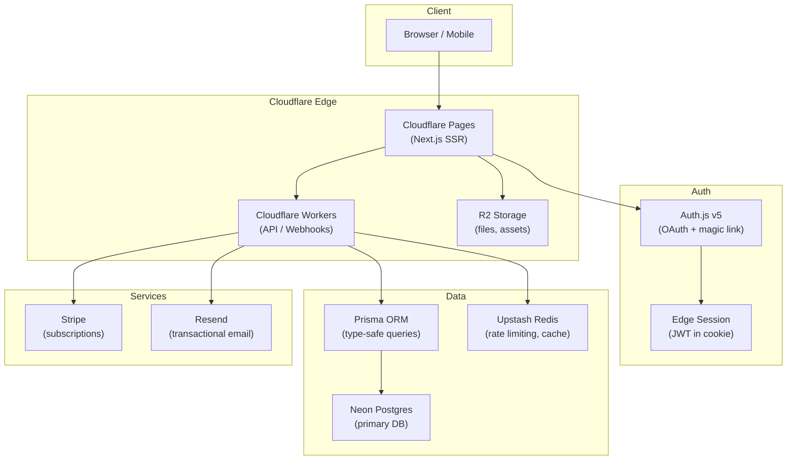

# Next.js SaaS Architecture

## System diagram



## File structure

```
src/
├── app/
│   ├── (auth)/
│   │   ├── login/page.tsx
│   │   └── register/page.tsx
│   ├── (dashboard)/
│   │   ├── layout.tsx          # org context provider
│   │   ├── [orgSlug]/
│   │   │   ├── page.tsx
│   │   │   ├── settings/
│   │   │   └── billing/
│   ├── api/
│   │   ├── auth/[...nextauth]/route.ts
│   │   ├── webhooks/stripe/route.ts
│   │   └── trpc/[trpc]/route.ts
│   └── layout.tsx
├── components/
│   ├── ui/                     # shadcn/ui primitives
│   └── app/                    # domain components
├── lib/
│   ├── auth.ts                 # Auth.js config
│   ├── db.ts                   # Prisma client singleton
│   ├── stripe.ts               # Stripe client
│   └── permissions.ts          # RBAC helpers
├── middleware.ts                # auth guard + org routing
└── types/
    └── index.ts
```

## Middleware (auth guard + org routing)

```typescript
// middleware.ts
import { auth } from "@/lib/auth";
import { NextResponse } from "next/server";

export default auth((req) => {
  const { pathname } = req.nextUrl;

  // Public routes
  if (pathname.startsWith("/login") || pathname.startsWith("/api/webhooks")) {
    return NextResponse.next();
  }

  // Redirect unauthenticated users
  if (!req.auth) {
    return NextResponse.redirect(new URL("/login", req.url));
  }

  return NextResponse.next();
});

export const config = {
  matcher: ["/((?!_next/static|_next/image|favicon.ico).*)"],
};
```

## Row-level security pattern

```typescript
// lib/db.ts — always scope queries to org
export async function getProjects(orgId: string, userId: string) {
  return prisma.project.findMany({
    where: {
      organizationId: orgId,            // always filter by org
      organization: {
        members: { some: { userId } },  // verify membership
      },
    },
  });
}
```

## Stripe webhook handler

```typescript
// app/api/webhooks/stripe/route.ts
import Stripe from "stripe";
import { stripe } from "@/lib/stripe";
import { prisma } from "@/lib/db";

export async function POST(req: Request) {
  const sig = req.headers.get("stripe-signature")!;
  const body = await req.text();

  let event: Stripe.Event;
  try {
    event = stripe.webhooks.constructEvent(body, sig, process.env.STRIPE_WEBHOOK_SECRET!);
  } catch {
    return new Response("Invalid signature", { status: 400 });
  }

  if (event.type === "customer.subscription.updated") {
    const sub = event.data.object as Stripe.Subscription;
    await prisma.organization.update({
      where: { stripeCustomerId: sub.customer as string },
      data: { plan: sub.status === "active" ? "pro" : "free" },
    });
  }

  return new Response(null, { status: 200 });
}
```

## Environment variables

```bash
# Auth
AUTH_SECRET=
AUTH_GITHUB_ID=
AUTH_GITHUB_SECRET=
AUTH_GOOGLE_ID=
AUTH_GOOGLE_SECRET=

# Database
DATABASE_URL=

# Stripe
STRIPE_SECRET_KEY=
STRIPE_WEBHOOK_SECRET=
NEXT_PUBLIC_STRIPE_PUBLISHABLE_KEY=

# Email
RESEND_API_KEY=
```
